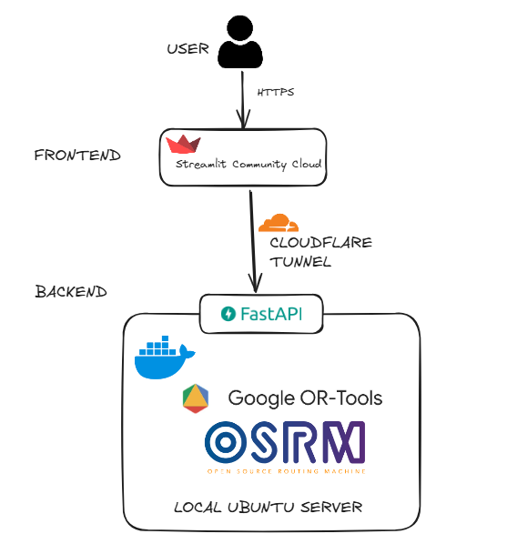

# UOC VRP Frontend

Streamlit application for interacting with the [UOC VRP backend](https://github.com/pabloperezv/uoc-vrp-backend).
Upload a CSV of customers, configure the fleet, run an optimisation and inspect
the resulting routes on an interactive Folium map. It follows the following architecture:



---

## Project layout

```
.
├── app.py                  # Landing page (multi-page entrypoint)
├── pages/
│   ├── 1_Solver.py         # Main page: upload + solve + visualise
│   └── 2_About.py
├── components/
│   ├── sidebar.py          # Sidebar widgets -> VRPParameters dataclass
│   ├── map_view.py         # Folium map renderers
│   └── metrics.py          # KPI cards + per-route tables
├── services/
│   ├── api_client.py       # Typed wrapper around the FastAPI backend
│   └── csv_loader.py       # CSV parsing + validation + payload builder
├── utils/
│   ├── settings.py         # Reads st.secrets / env vars
│   └── formatting.py       # Human-friendly distance/time formatting
├── assets/
│   └── vrp-solver-architecture.png
├── .streamlit/
│   ├── config.toml
│   └── secrets.toml.example
└── requirements.txt
```

The structure follows the **same separation principle** as the backend:
`pages` orchestrate, `components` render, `services` talk to external systems,
`utils` are pure functions.

---

## Local development

```bash
python -m venv .venv && source .venv/bin/activate
pip install -r requirements.txt

cp .streamlit/secrets.toml.example .streamlit/secrets.toml
# edit secrets.toml: BACKEND_URL = "http://localhost:8010"  (origin only; no /api/v1)
# optional: OSRM_BASE_URL for road polylines on the map (defaults to http://127.0.0.1:5000)

streamlit run app.py
```

Open <http://localhost:8501> in your browser.

---

## CSV format

| Column     | Type   | Notes                              |
|------------|--------|------------------------------------|
| `id`       | string | Unique customer id.                |
| `name`     | string | Defaults to `id`.                  |
| `latitude` | float  | WGS84, in `[-90, 90]`.             |
| `longitude`| float  | WGS84, in `[-180, 180]`.           |
| `demand`   | int    | Integer units. Defaults to `1`.    |

## Author
Pablo Perez Verdugo